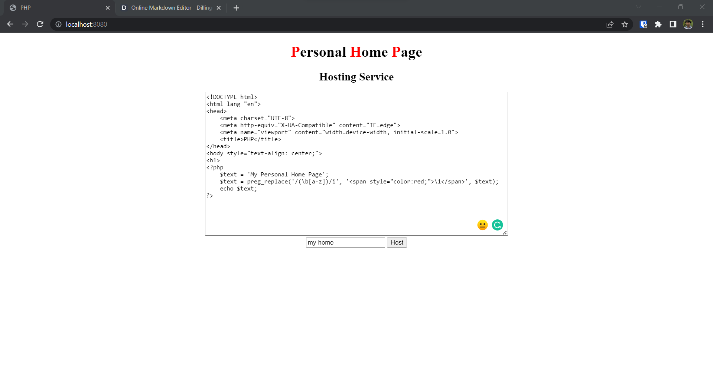
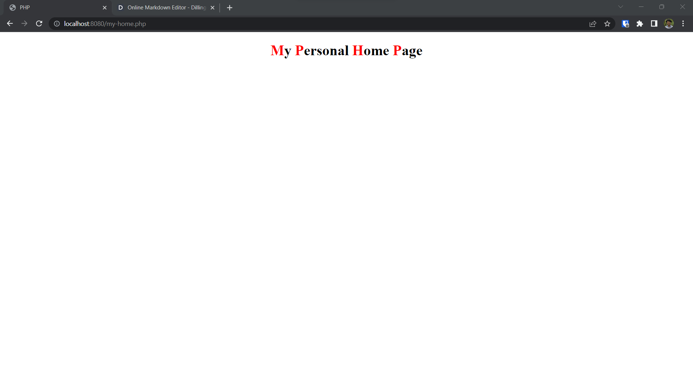

# P*ersonal* H*ome* P*age*

**P**ersonal **H**ome **P**age (PHP) is a PHP application that allows the user to host their own PHP Personal Home Page by just entering their PHP code into a web form. 
The steps below describes how to use it.

## Install Docker

### Windows

[Download Docker](https://desktop.docker.com/win/main/amd64/Docker%20Desktop%20Installer.exe) and install

### Ubuntu

[Download Docker](https://desktop.docker.com/linux/main/amd64/docker-desktop-4.12.0-amd64.deb?utm_source=docker&utm_medium=webreferral&utm_campaign=docs-driven-download-linux-amd64) and open a terminal in the folder you have downloaded to.

Run this in the terminal:

```bash
  sudo apt purge docker-desktop
  sudo apt-get update
  sudo apt-get install ./*.deb
```

## Create A Project

1.  Create a folder
2. Create a file `docker-compose.yml`  and add this to it:

```yml
version: "3.9"

services:
    web:
        image: nginx:latest
        ports:
            - "8080:80"
        volumes:
            - ./:/var/www/html
            - ./default.conf:/etc/nginx/conf.d/default.conf
        links:
            - php-fpm
    php-fpm:
        image: php:8-fpm
        volumes:
            - ./:/var/www/html
```

3. Create a file `default.conf` and add this to it:

```conf
server {
    index index.php index.html;
    server_name phpfpm.local;
    error_log  /var/log/nginx/error.log;
    access_log /var/log/nginx/access.log;
    root /var/www/html;
    location ~ \.php$ {
        try_files $uri =404;
        fastcgi_split_path_info ^(.+\.php)(/.+)$;
        fastcgi_pass php-fpm:9000;
        fastcgi_index index.php;
        include fastcgi_params;
        fastcgi_param SCRIPT_FILENAME $document_root$fastcgi_script_name;
        fastcgi_param PATH_INFO $fastcgi_path_info;
    }
}
```

4. Create a `src/index.php` file and add this to it:

```php
<!DOCTYPE html>
<html lang="en">
<head>
    <meta charset="UTF-8">
    <meta http-equiv="X-UA-Compatible" content="IE=edge">
    <meta name="viewport" content="width=device-width, initial-scale=1.0">
    <title>PHP</title>
</head>
<body style="text-align: center;">
<h1>
<?php
    $text = 'Personal Home Page';
    $text = preg_replace('/(\b[a-z])/i', '<span style="color:red;">\1</span>', $text);
    echo $text;
?>
</h1>
<h2>Hosting Service</h2>
<form action="/" method="post">
        <textarea class="text" cols="86" rows ="20" name="code" placeholder="PHP code"></textarea><br>
        <input type="text" name="name" placeholder="Name">
        <input type="submit" value="Host">
</from>

<?php
    if (isset($_POST['code']) && isset($_POST['name'])) {
        $code = $_POST['code'];
        $name = $_POST['name'];
        $file = fopen($name . ".php", "w");
        fwrite($file, $code);
        fclose($file);

        echo "<a href='$name.php'>$name</a> Hosted";
    }
?>

</body>
</html>
```

## Run Project

Open a terminal inside your project directory and run:

```sh
docker-compose up
```

## Output

Open your browser and go to [http://localhost:8080](http://localhost:8080)


Add your PHP code, give your site a name and click on `Host`



Your site will be hosted at [http://localhost:8080/your-site-name.php](http://localhost:8080/your-site-name.php)


